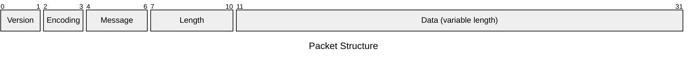
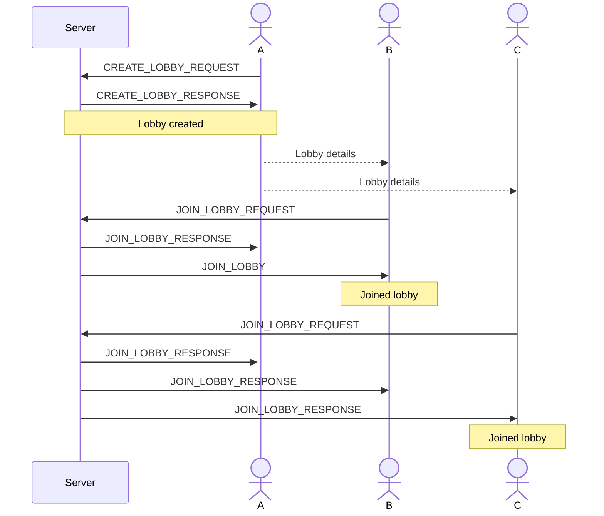
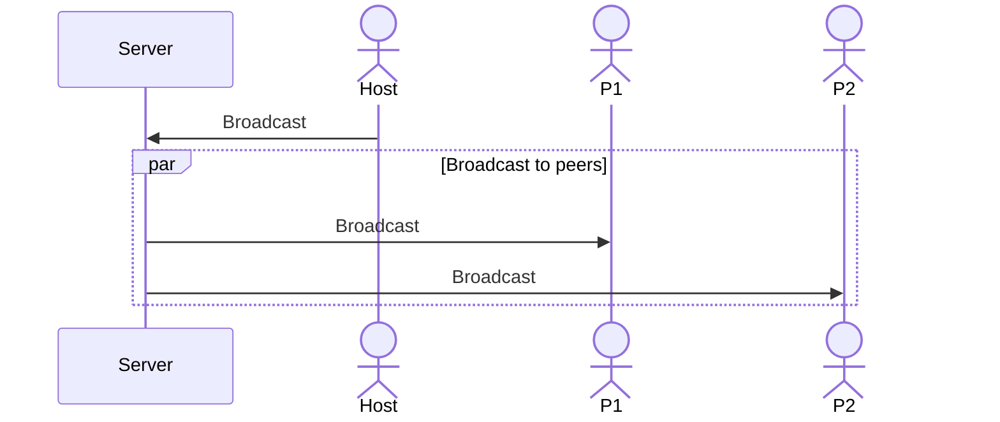
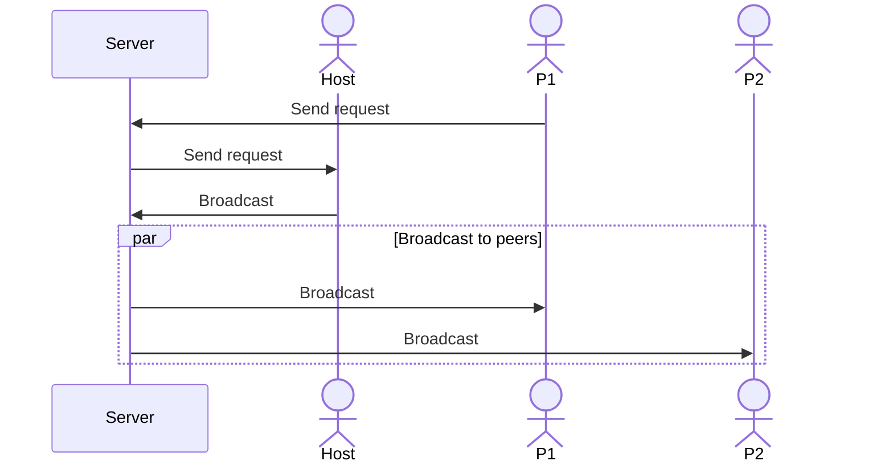

# Protocol

## Frame Structure
A frame consits of a 10 byte header followed by variable length data.

### Version

A single byte that specifies the version of the protocol in use.

### Encoding Types

A single byte that defines how the data in the frame is encoded. The following encoding types are supported:

| Code | Encoding    |
| ---- | ----------- |
| 0    | JSON        |
| 1    | MessagePack |

### Message Types

Two bytes that define the type of the message. Below is the list of message types with their corresponding descriptions.

| Code | Name                    | Description                                           | Data |
| ---- | ----------------------- | ----------------------------------------------------- | ---- |
| 0    | `BROADCAST_REQUEST`     | A message to send to all peers in the lobby.          | TBC  |
| 1    | `BROADCAST_RESPONSE`    | Response indicating if the broadcast was accepted.    | TBC  |
| 2    | `BROADCAST`             | A message send to all peers in the lobby.             | TBC  |
| 3    | `CREATE_LOBBY_REQUEST`  | A Request to create a new lobby.                      | TBC  |
| 4    | `CREATE_LOBBY_RESPONSE` | Response indicating if the lobby was created.         | TBC  |
| 5    | `JOIN_LOBBY_REQUEST`    | Request to join an existing lobby.                    | TBC  |
| 6    | `JOIN_LOBBY_RESPONSE`   | Response indicating if the join request was accepted. | TBC  |
| 7    | `DISCONNECTION`         | A peer has disconnected from the lobby.               | TBC  |

### Length
TODO

### Data
TODO

## Private Lobby Workflow

### Lobby Creation Process

The following diagram illustrates the flow for creating a private lobby:

### Message relay

#### Host-to-Peer Message Relay

When the host sends a message to all peers in the lobby:

#### Peer-to-Host Message Relay

When a peer sends a request to the host, which is then broadcast to all peers:

